# Linux Network

## Инструмент ipcalc

### 1.1. Сети и маски

Определить и записать в отчёт: 

1) Адрес сети 192.167.38.54/13
   
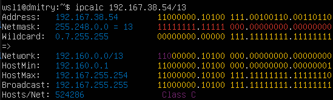

192.160.0.0 

2) Перевод маски 255.255.255.0 в префиксную и двоичную запись: 

* /24
* 11111111.11111111.11111111.00000000 

/15 в обычную и двоичную:

* 255.254.0.0 
* 11111111.11111110.00000000.00000000 

11111111.11111111.11111111.11110000 в обычную и префиксную:

* 255.255.255.240 
* /28

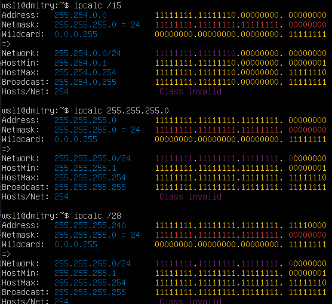

3) Минимальный и максимальный хост в сети 12.167.38.4 при масках: 
/8
* HostMin 12.0.0.1
* HostMax 12.255.255.254
11111111.11111111.00000000.00000000
* HostMin 12.167.0.1
* HostMax 12.167.255.254
255.255.254.0
* HostMin 12.167.38.1
* HostMax 12.167.39.254
  
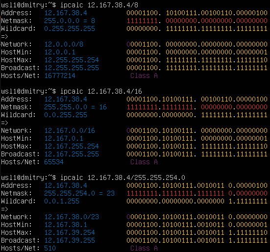

/4:
* HostMin 0.0.0.1
* HostMax 15.255.255.254
  
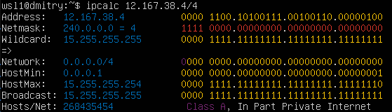

## 1.2. localhost
Определить и записать в отчёт, можно ли обратиться к приложению, работающему на localhost, со следующими IP: 194.34.23.100, 127.0.0.2, 127.1.0.1, 128.0.0.1

* 127.0.0.2, 127.1.0.1 - возможно Loopback
* 194.34.23.100, 128.0.0.1 - не возможно

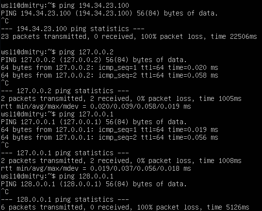

## 1.3 Диапазоны и сегменты сетей
Определить и записать в отчёт:
1) какие из перечисленных IP можно использовать в качестве публичного, а какие только в качестве частных:

* приватные:
1. 10.0.0.45
2. 192.168.4.2
3. 172.20.250.4
4. 172.16.255.255
5. 10.10.10.10
* публичные:
1. 134.43.0.2
2. 172.0.2.1
3. 192.172.0.1
4. 172.68.0.2
5. 192.169.168.1

2) Какие из перечисленных IP-адресов шлюза возможны у сети 10.10.0.0/18: 10.0.0.1, 10.10.0.2, 10.10.10.10, 10.10.100.1, 10.10.1.255

* возможны:
10.10.0.2, 10.10.10.10, 10.10.1.255
* не возможны:
10.0.0.1, 10.10.100.1

## Статическая маршрутизация между двумя машинами

ip a

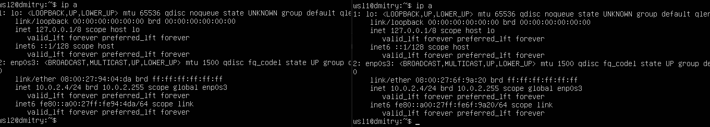

на обеих машинах и задал следующие адреса, маски и вывод команды netplan apply

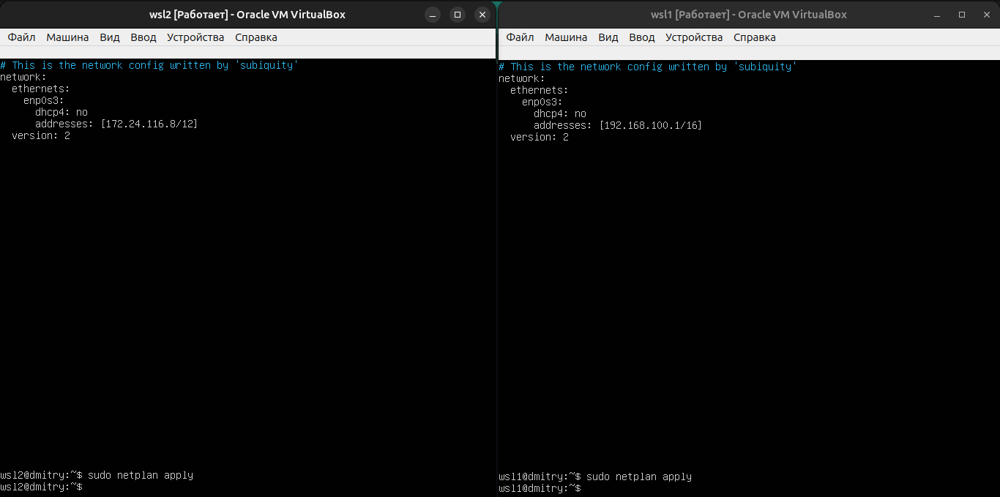

### 2.1. Добавление статического маршрута вручную

Добавь статический маршрут от одной машины до другой и обратно при помощи команды вида ip r add. Пропингуй соединение между машинами.

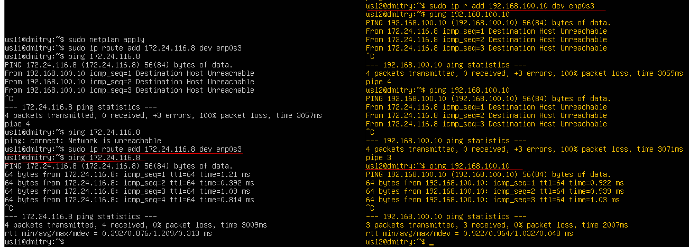

### 2.2. Добавление статического маршрута с сохранением

Добавь статический маршрут от одной машины до другой с помощью файла /etc/netplan/00-installer-config.yaml.

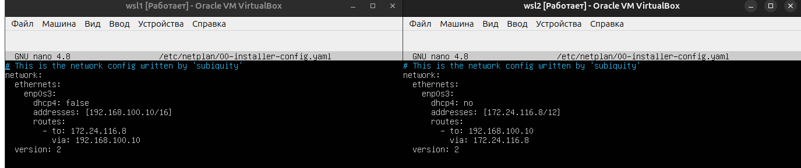

Пропингуй соединение между машинами.

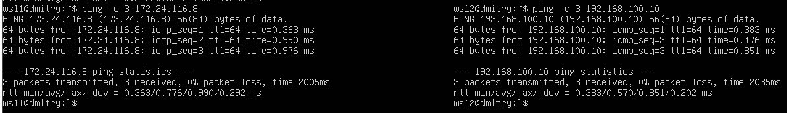

## 3. Утилита iperf3
### 3.1 Скорость соединения
- 8 Mbps = 1 MB/s (Мегабит/сек в Мегабайт/сек)
- 100 MB/s = 800000 Kbps, (Мегабайт/сек в Килобит/сек)
- 1 Gbps = 1000 Mbps (Гигабит/сек в Мегабит/сек)
### 3.2 Утилита iperf3
Машина ws1 будет выступать в роли сервера, запускаем на ней `iperf3 -s`; ws2 - в качестве клиента, запускаем на ней `iperf -c 192.168.100.10` (ip сервера)
Скорость соединения 1.69 Гигабит/сек

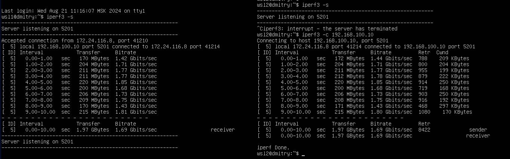

## 4. Сетевой экран

### 4.1. Утилита iptables

B отчёт помести скрины с содержанием файла /etc/firewall для каждой машины.В отчёт помести скрины с запуском обоих файлов.

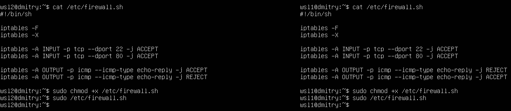

Файл `/etc/firewall.sh` на обеих машинах различается порядком команд, утилита iptables выполняет первое прочитанное правило, по этому на ws1 будет выполнятся запрет, и пинг не пройдет. А на ws2 – наоборот, первым стоит `ACCEPT`, разрешить прохождение пакета, пинг пройдет

### 4.2. Утилита nmap

В отчёт помести скрины с вызовом и выводом использованных команд ping и nmap.

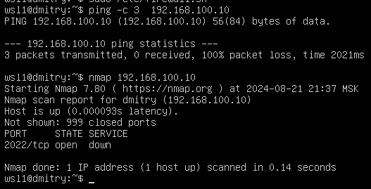

## 5. Статическая маршрутизация сети

Подними пять виртуальных машин (3 рабочие станции (ws11, ws21, ws22) и 2 роутера (r1, r2)).

### 5.1. Настройка адресов машин

онфигурации машин в etc/netplan/00-installer-config.yaml согласно сети на рисунке.

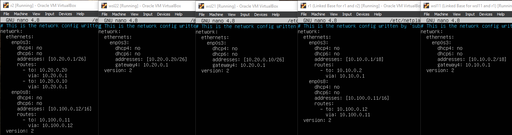

Если ошибок нет, командой ip -4 a проверь, что адрес машины задан верно. Также пропингуй ws22 с ws21. Аналогично пропингуй r1 с ws11.
Пинг обведен зеленым прямоугольником, красным вывод команды ip -4 a

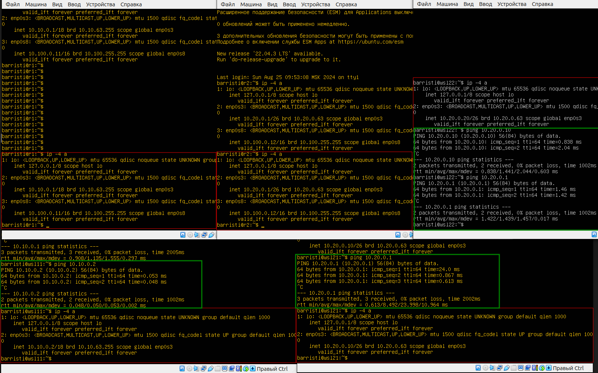

### 5.2. Включение переадресации IP-адресов

Для включения переадресации IP выполни команду на роутерах:
sysctl -w net.ipv4.ip_forward=1

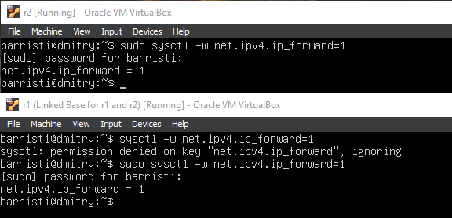

Изменяем файл /etc/sysctl.conf.

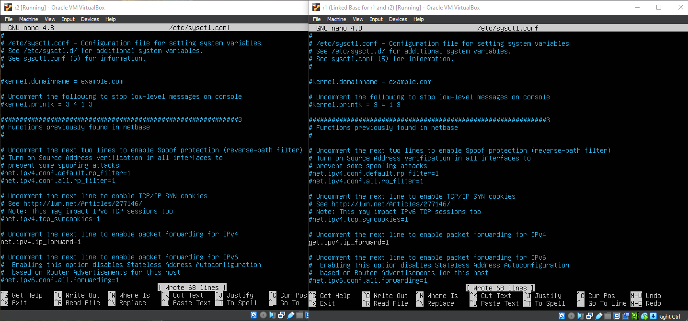

### 5.3. Установка маршрута по умолчанию

вывода команды ip r после добавления шлюза содержанием файла etc/netplan/00-installer-config.yaml;:

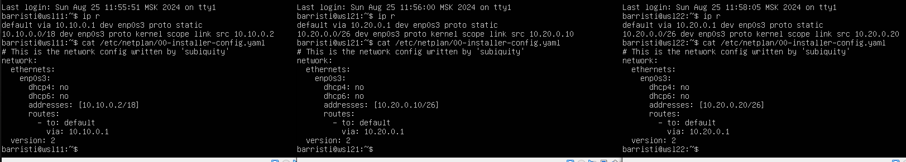

Пинг с ws11 роутер r2. На r2,  пинг доходит.

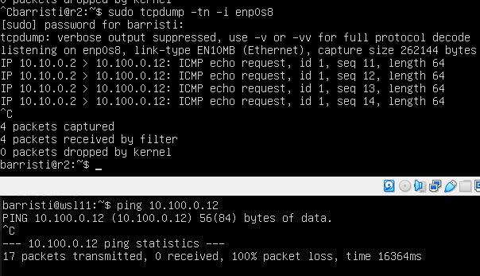

### 5.4. Добавление статических маршрутов

Добавил в роутеры r1 и r2 статические маршруты в файле конфигурации

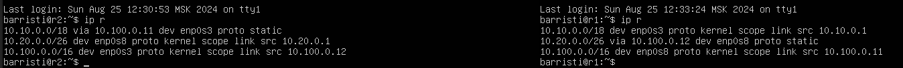

Вызови ip r и покажи таблицы с маршрутами на обоих роутерах. Пример таблицы на r1:
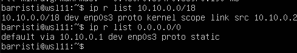

Запустил команды на ws11 ip r list 10.10.0.0/18 и ip r list 0.0.0.0/0

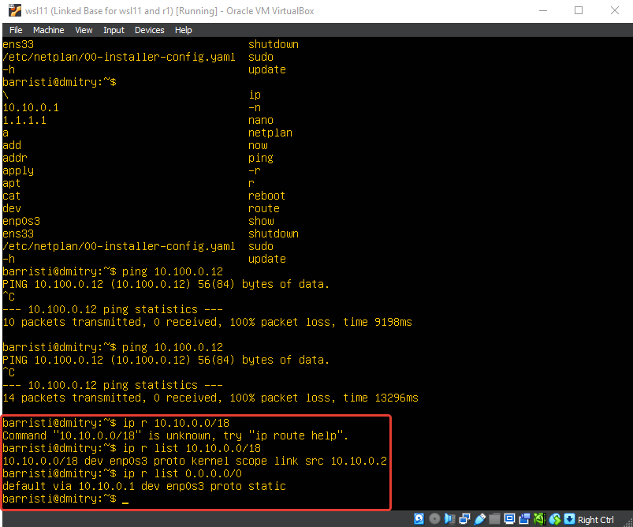

Почему для адреса 10.10.0.0/18 был выбран маршрут, отличный от 0.0.0.0/0, хотя он попадает под маршрут по-умолчанию.
При наличии двух и более маршрутов выбирается маршрут с самой длинной маской т.к. он более точный

### 5.5. Построение списка маршрутизаторов

вывода утилиты traceroute после добавления шлюза:
Запустил на r1 команду дампа и 
При помощи утилиты traceroute, построил список маршрутизаторов на пути от ws11 до ws21.

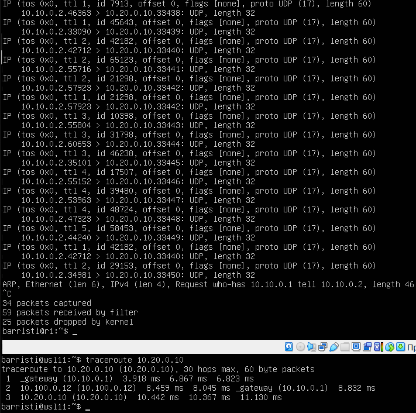

Принцип работы traceroute заключается в отправке целевому узлу серии ICMP-пакетов с увеличивающимся значением поля TTL (время жизни). Каждый маршрутизатор, проходящий пакет, уменьшает значение TTL и возвращает ICMP-сообщение «time exceeded in transit», указывая на невозможность доставки данных. Traceroute фиксирует адреса маршрутизаторов и время между отправкой пакета и получением ответа. Процесс повторяется до тех пор, пока пакет не достигнет целевого узла.

### 5.6. Использование протокола ICMP при маршрутизации

Запустил на r1 перехват сетевого трафика и пропиновал с ws11 несуществующий IP 10.30.0.111

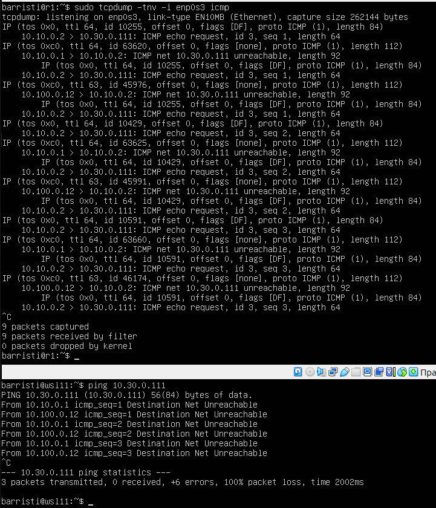

### Part 6. Динамическая настройка IP с помощью DHCP

r2 настрой в файле /etc/dhcp/dhcpd.conf конфигурацию службы DHCP: 
В файле resolv.conf nameserver 8.8.8.8
Перезагрузил службу DHCP командой systemctl restart isc-dhcp-server.

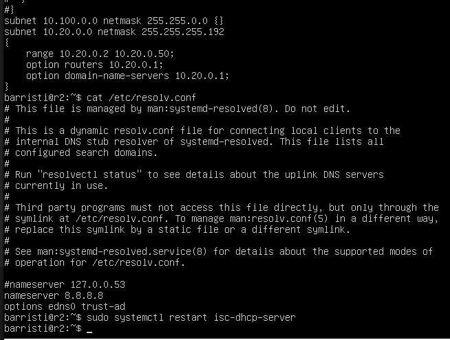

Машину ws21 перезагрузил при помощи reboot, через команду  ip a  убедились что она получила адрес. Также пропинговал ws22 с ws21.

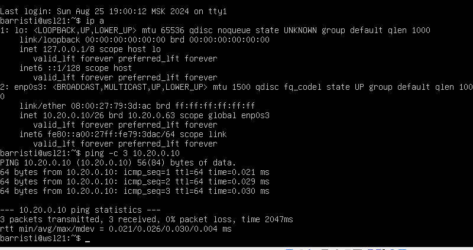

Укажи MAC-адрес у ws11, для этого в etc/netplan/00-installer-config.yaml надо добавить строки: macaddress: 10:10:10:10:10:BA, dhcp4: true.

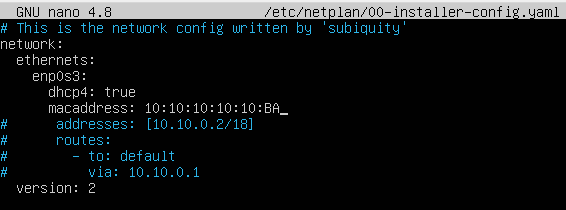

Для r1 настроил аналогично r2, но сделал выдачу адресов с жесткой привязкой к MAC-адресу (ws11). Провел аналогичные тесты

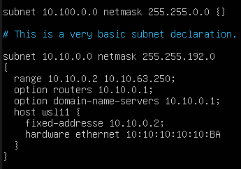

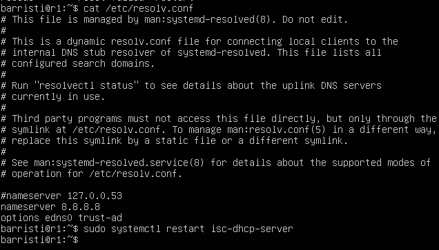

Запросил с ws21 обновление IP-адреса.

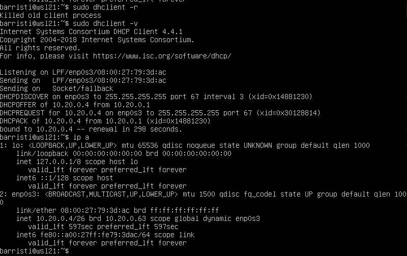

## 7. NAT

В файле /etc/apache2/ports.conf на ws22 и r1 измени строку Listen 80 на Listen 0.0.0.0:80, то есть сделай сервер Apache2 общедоступным.
Запусти веб-сервер Apache командой service apache2 start на ws22 и r1.

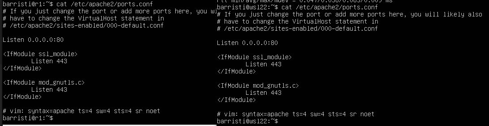
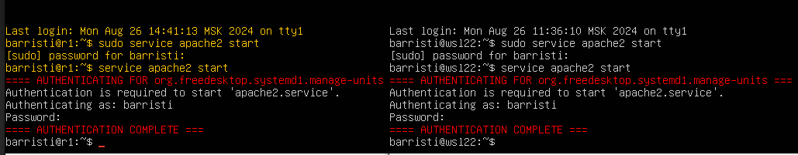
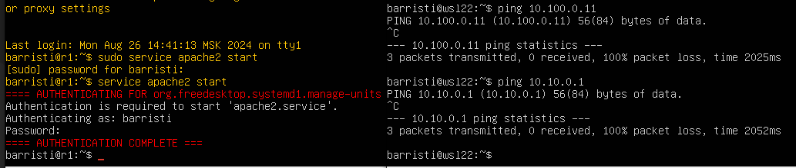

Добавь в фаервол, созданный по аналогии с фаерволом из Части 4, на r2 следующие правила:
Запусти файл также, как в Части 4.
Проверь соединение между ws22 и r1 командой ping.

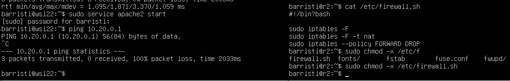

Добавь в файл ещё одно правило:
Разрешить маршрутизацию всех пакетов протокола ICMP.
Запусти файл также, как в Части 4.
Проверь соединение между ws22 и r1 командой ping.

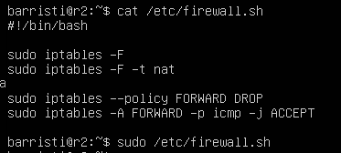

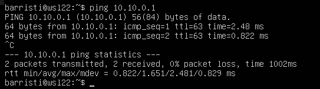

Добавь в файл ещё два правила:
Включи SNAT, а именно маскирование всех локальных IPиз локальной сети, находящейся за r2 (по обозначениям из Части 5 — сеть 10.20.0.0).
Совет: стоит подумать о маршрутизации внутренних пакетов, а также внешних пакетов с установленным соединением.
Включи DNAT на 8080 порт машины r2 и добавить к веб-серверу Apache, запущенному на ws22, доступ извне сети.

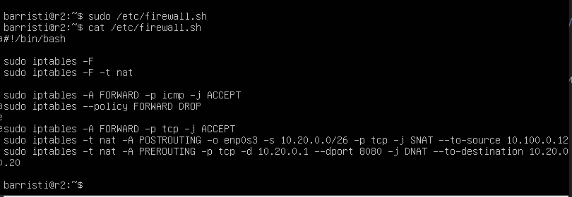

Проверь соединение по TCP для SNAT: для этого с ws22 подключиться к серверу Apache на r1 командой:
Проверь соединение по TCP для DNAT: для этого с r1 подключиться к серверу Apache на ws22 командой telnet (обращаться по адресу r2 и порту 8080).

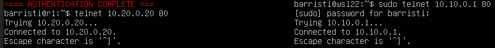

## 8. Дополнительно. Знакомство с SSH Tunnels

Запусти на r2 фаервол с правилами из Части 7.
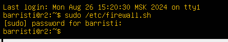

Запусти веб-сервер Apache на ws22 только на localhost (то есть в файле /etc/apache2/ports.conf измени строку Listen 80 на Listen localhost:80).

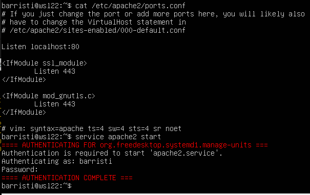

Воспользуйся Local TCP forwarding с ws21 до ws22, чтобы получить доступ к веб-серверу на ws22 с ws21.

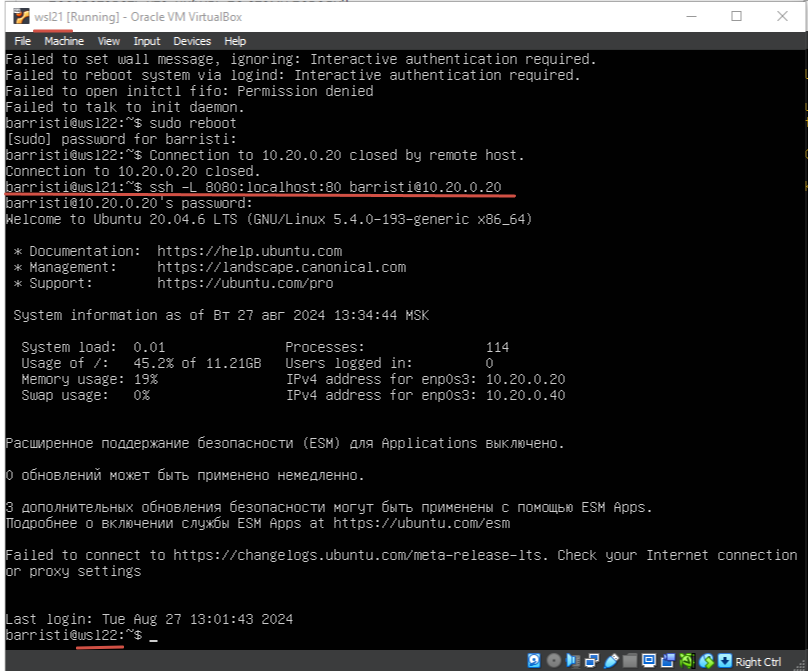

Воспользуйся Remote TCP forwarding c ws11 до ws22, чтобы получить доступ к веб-серверу на ws22 с ws11.

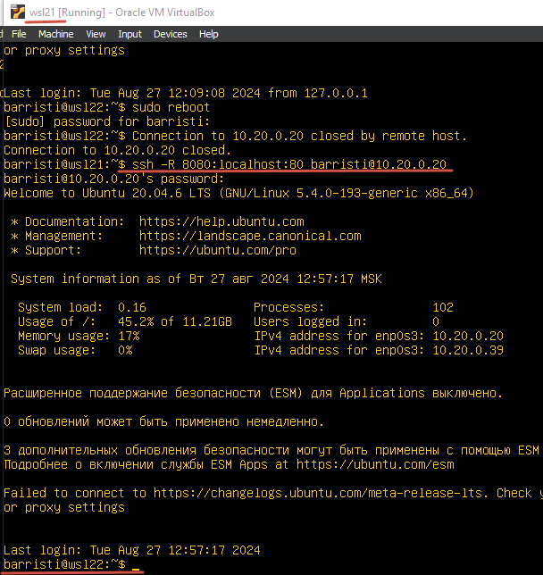

Для проверки, сработало ли подключение в обоих предыдущих пунктах, перейди во второй терминал (например, клавишами Alt + F2) и выполни команду:

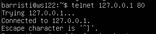
